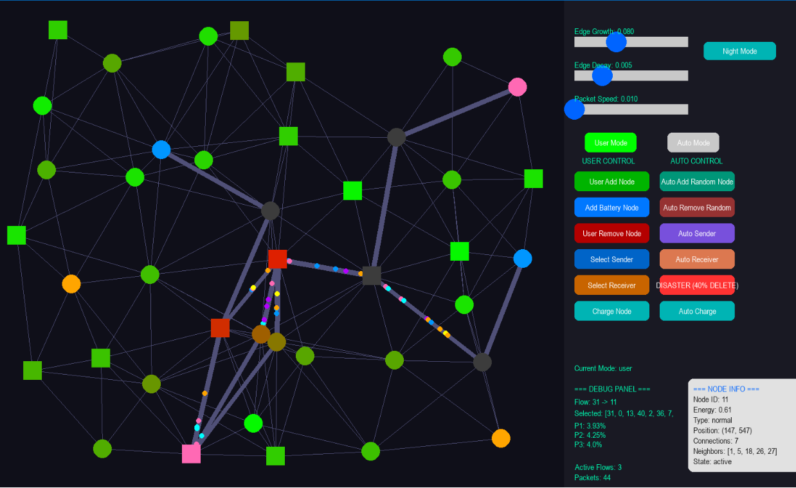

# Mycelium Network-Based Dynamic Data Routing Simulation

## Overview

This project presents a bio-inspired network simulation that models decentralized and adaptive data routing based on the behavior of mycelium networks. The simulation demonstrates how data packets can be transmitted through a dynamic mesh network under changing network conditions, including node failures and disaster scenarios.

## Project Motivation

Conventional communication infrastructure may become unavailable during natural disasters. This project explores how biological mycelium-inspired behavior can be applied to develop decentralized routing strategies that improve communication resilience in such environments.

## Technologies

- Python
- NetworkX
- Pygame
- Graph Theory

## Key Features

- Bio-inspired decentralized routing algorithm
- Real-time packet transmission visualization
- Dynamic path selection based on network conditions
- Node energy management
- Battery node support
- Interactive control panel
- User and automatic simulation modes
- Disaster simulation with node failures
- Adaptive edge reinforcement and decay mechanism
- Live network visualization and debugging panel

## Simulation Overview

## How It Works

The routing algorithm evaluates multiple network parameters while selecting the optimal path, including:

- Node energy level
- Connection strength
- Network congestion
- Distance
- Previous routing experience (memory)
- Dynamic edge reinforcement

Instead of relying on a centralized controller, the network continuously adapts its routing decisions according to current conditions.

## Future Improvements

- Machine learning-based routing optimization
- Larger-scale network simulations
- Integration with real-world mesh network environments
- Performance evaluation using different routing strategies
